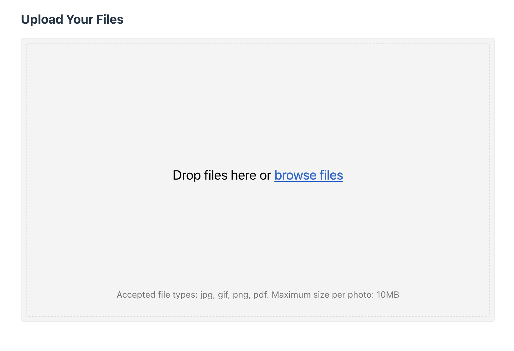

````markdown
# 📂 File Uploads Made Easy with Uppy.js + React

This repo contains the full source code for the [YouTube tutorial](https://www.youtube.com/@lgsantiago) **"Master File Uploads in Minutes with Uppy.js"** – a beginner-friendly walkthrough that shows you how to add a drag-and-drop file uploader to your React app using [Uppy](https://uppy.io/).

---

### 🔥 What You'll Learn

- How to set up Uppy in a React app using Vite
- How to use the `@uppy/dashboard` component to create a clean, modern UI
- How to upload files to a backend with `@uppy/xhr-upload`
- How to enable image editing with `@uppy/image-editor`
- How to customize restrictions like file type and file count

---

### 📦 Tech Stack

- React (with Vite)
- Uppy Core
- @uppy/dashboard
- @uppy/xhr-upload
- @uppy/image-editor
- Tailwind CSS (for basic styling)

---

### 🚀 Getting Started

#### 1. Clone the repo

```bash
git clone https://github.com/lgsantiago/file-uploads-made-easy.git
cd file-uploads-made-easy
```
````

#### 2. Install dependencies

```bash
npm install
```

#### 3. Start the development server

```bash
npm run dev
```

Open `http://localhost:5173` in your browser to view the app.

---

### 🧪 Features

- 🖱 Drag & drop file upload interface
- 📷 Image cropping, rotating, flipping with `@uppy/image-editor`
- 🔄 Upload status tracking and completion logs
- 🔐 File type and file count restrictions
- 🎨 Easy-to-style UI with Tailwind

---

### 📸 Demo Screenshots

Here are a few screenshots showcasing the Uppy uploader in action:

#### 🧲 Drag-and-Drop Interface


---

#### 📁 Files Selected & Ready to Upload



---

#### 🖼 Image Editing with `@uppy/image-editor`


---

#### ✅ File Upload Complete


---

### 📁 Folder Structure

```
src/
├── FileUploader.jsx      # Main Uppy integration component
├── App.jsx               # Main entry point
└── index.css             # Tailwind styles
```

---

### 📄 License

This project is open-source and available under the [MIT License](LICENSE).

---

### 🙌 Support

If this project helped you, consider giving it a ⭐ on GitHub and subscribing on [YouTube](https://www.youtube.com/@lgsantiago) for more tutorials like this one!
